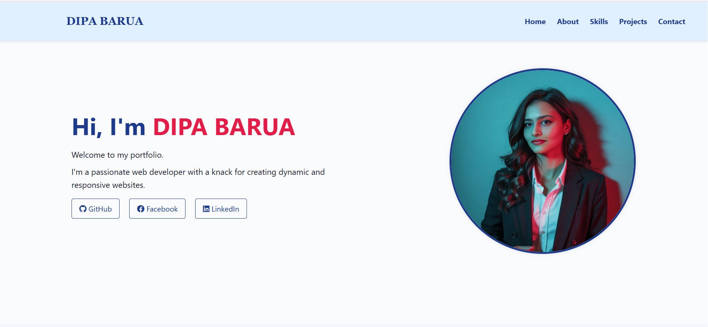

# 🌐 Personal Portfolio Website

Hey there! 👋 This is my personal portfolio website, built to showcase my skills, projects, and ways to get in touch with me. It's clean, responsive, and crafted with love using HTML, CSS, and FontAwesome icons.
---

## 📸 Preview

## Here's a sneak peek of what the portfolio looks like:

---

## ✨ Features
- 🖼️ Clean & Responsive Design – Works on desktops, tablets, and mobiles.
- 📱 Mobile-first Approach – Smooth layout adjustments with media queries.
- 🧑‍💻 Organized Sections – About, Skills, Projects, and Contact.
- 🔗 Quick Links – Direct access to my GitHub, LinkedIn, and Facebook profiles.
- 🎨 Interactive Styling – Hover effects, animations, and modern UI touches.

---

## 🛠️ Tech Stack
- **HTML5** – Page structure  
- **CSS3** – Styling and responsiveness  
- **FontAwesome** – Icons  
- **Git & GitHub** – Version control  

---

## 📂 Project Structure
- **index.html** → contains the structure of the entire website (sections: Home, About, Skills, Projects, Contact).  
- **style.css** → styling rules, responsive design, animations, and hover effects.  
- **README.md** → detailed documentation for GitHub repository.  
- **images/** → centralized folder for profile picture, skill icons, and project thumbnails. 
